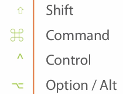

# VSCode
### By John Papa Pluralsight 28 Aug 2015

https://code.visualstudio.com/

https://github.com/johnpapa/pluralsight-vscode-samples

- Built using Electron - formerly known as Atom Shell made by GitHub
    - Uses Squirrel for application updates
    - FirstMate for TextMate syntax bundle support
    - Behind it is Chromium, Node JS, TypeScript Server and OmniSharp Roslyn
    - Written by Erich Gamma and Chris Dias (who also wrote the online editor Monaco)

File > Auto Save = Toggles the Auto Save feature indicated by a |- [x] to its left

To start VSCode from the shell use:

- Shift + Ctrl + P = Command Palette 
- code . = open Code for the current folder
- code index.html -r = opens file in the last active instance
- code src/another/app -n = open file in a new instance
- code -g src/client/app/home.controller.js:10:8 u

Other shortcuts:

- Ctrl + \<n> = Take the cursor to the \<n>th tab that you have open
